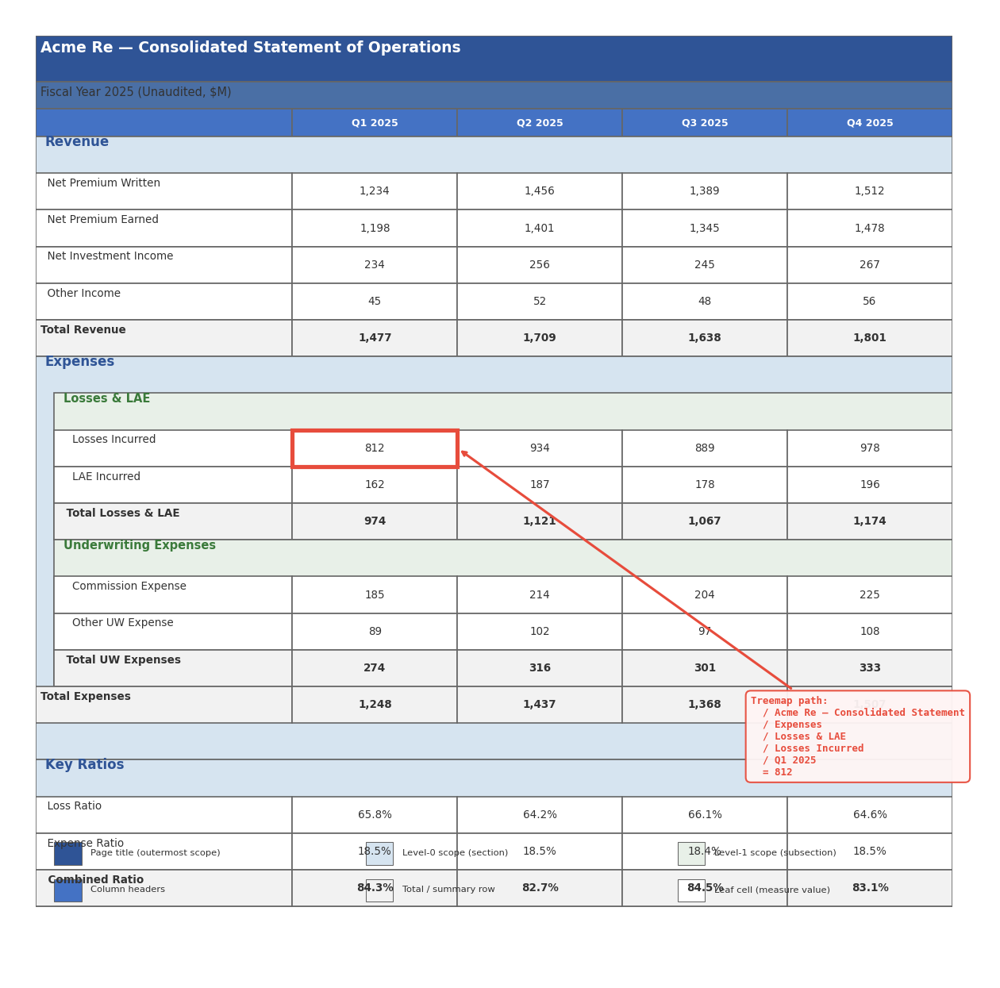

# Progressive Masking and Treemap Layout Recovery

> Every document page is a treemap. Labels partition vertical space into
> nested scopes; column headers partition horizontal space. The address of
> any cell is the path from root to leaf through these partitions.

## The Problem

Given a PDF or XLSX document rendered as a flat set of bounding boxes
`(page, x, y, w, h, text, style)`, recover:

1. Which bboxes are **structural** (labels, headers, titles) vs **content** (measures, dimensions)
2. The **hierarchical scope** each content cell belongs to
3. A **treemap path** that fully qualifies each value — equivalent to a compound key in a normalized table

## Progressive Masking

Classification proceeds in rounds. Each round identifies a category of
bboxes and **masks them out** (removes them from the working set). Later
rounds operate on a smaller, less ambiguous residual.

### Round 1: Unambiguous types (cheapest)

- `TRY_CAST` probes: pure integers, floats, dates
- Regex probes: currency (`$12,400`), percentages (`65.8%`), zip codes,
  UUIDs, ISO dates, phone numbers, email addresses
- These are **measures** or typed values — mask them immediately

### Round 2: Page chrome

- **Page title**: largest font size on the page, positioned in the top region
- **Page number**: short numeric text at the bottom of the page
- **Repeating headers/footers**: identical text at the same `(x, y)` across
  multiple pages

Page title and page number form the **outermost scope layer** — they
apply to every bbox on their page.

### Round 3: Common vocabulary filter (planned)

- Probe each remaining text bbox against a ~50K common English words
  bitmap (using the same [[blobfilters]] roaring bitmap infrastructure)
- Also probe against domain-specific filters (company names, product IDs,
  geographic names, etc.)
- **Mask rule**: if a bbox matches common vocab AND does NOT match any
  domain filter, it's prose/boilerplate/label text — mask it as structural
- Bboxes that match both common vocab and a domain filter stay visible
  (e.g., "Apple" is both an English word and a company name)

### Round 4: Domain filter probing

- Remaining unmasked text bboxes are probed against domain filters
- Matches are classified as dimension values (categorical)
- This layer uses the existing [[blobfilters]] infrastructure

### Round 5: Embedding / LLM fallback

- Only genuinely ambiguous bboxes reach this expensive layer
- The progressive masking typically eliminates 60-80% of bboxes before
  this point

## Label Scope Propagation

A bold label or section header is **in force to the right and downward**
until the next label at the same or lesser indent level.

### Indent levels from geometry

Labels are identified by style (bold weight, larger font) and position
(leftmost cell in a row with no numeric content). Their x-coordinate
determines their indent level — clustered by gap-based analysis of
distinct left-edge positions:

```
x ≈ 60   → indent level 0  (e.g., "Revenue", "Expenses")
x ≈ 78   → indent level 1  (e.g., "Net Premium Written", "Losses & LAE")
x ≈ 96   → indent level 2  (e.g., "Losses Incurred", "Commission Expense")
```

### Scope rules

1. A label at level N is in force for all rows below it until the next
   label at level ≤ N
2. A label at level N **resets** all deeper scopes (level > N)
3. Column headers partition horizontally within each scope band

### Example: insurance financial statement

```
Acme Re — Consolidated Statement of Operations     ← page title (outermost scope)
Fiscal Year 2025 (Unaudited, $M)                   ← subtitle scope

                        Q1 2025   Q2 2025   Q3 2025   Q4 2025    ← column headers

Revenue                                                           ← scope_l0
  Net Premium Written    1,234     1,456     1,389     1,512      ← row label + measures
  Net Premium Earned     1,198     1,401     1,345     1,478
  Net Investment Income    234       256       245       267
  Other Income              45        52        48        56
Total Revenue            1,477     1,709     1,638     1,801      ← total (bold)

Expenses                                                          ← scope_l0
  Losses & LAE                                                    ← scope_l1
    Losses Incurred        812       934       889       978      ← leaf values
    LAE Incurred           162       187       178       196
  Total Losses & LAE      974     1,121     1,067     1,174
  Underwriting Expenses                                           ← scope_l1
    Commission Expense     185       214       204       225
    Other UW Expense        89       102        97       108
  Total UW Expenses       274       316       301       333
```

The measure cell `812` at row "Losses Incurred", column "Q1 2025" has
the treemap path:

```
Acme Re — Consolidated Statement of Operations
  / Fiscal Year 2025
  / Expenses
  / Losses & LAE
  / Losses Incurred
  / Q1 2025
  = 812
```

This path is exactly the compound dimension key you'd need if this data
were in a star schema fact table.

## The Page as Treemap



The page **is** a treemap — the labels define the partition boundaries:

1. **Level-0 labels** ("Revenue", "Expenses") divide the page into
   vertical bands spanning the full width
2. **Level-1 labels** ("Losses & LAE", "Underwriting Expenses") subdivide
   those bands, indented — narrower horizontal extent
3. **Column headers** ("Q1 2025", ...) partition horizontally within each band
4. **Leaf cells** (the numbers) sit at the intersection of a vertical
   scope path and a horizontal column

The masking pattern itself encodes structure: a column where every cell
blanked out (all common-vocab matches) is a label column. A row where
most cells blanked out is a header row. The blank regions **are** the
tree nodes; the remaining visible cells are the leaf values.

This works for documents that aren't tables at all. A legal contract with
sections, subsections, and clauses has the same spatial structure —
indented headings partition vertical space. The "measures" are clause text
rather than numbers, but the treemap address is the same.

## Implementation

The current prototype is in `experiments/progressive_masking.py` — a
single DuckDB SQL pipeline with ~15 CTEs:

1. **RAW**: extract bboxes with styles, deriving bold from font name
2. **ROWS**: gap-based row clustering (handles punctuation baseline offsets)
3. **CELLS / MERGED / CLEAN**: cell merging within rows
4. **PAGE_SCOPE**: page title and page number detection
5. **ROUND1**: TRY_CAST + regex classification (measures, dates, currency)
6. **INDENT_BINS**: gap-based indent level detection from left edges
7. **LABELS**: identify labels by bold weight + position + numeric content
8. **SCOPE_PROPAGATED / SCOPED**: window-function-based scope propagation
   with level reset
9. **COL_HEADERS**: column header detection
10. **FINAL**: assembly with treemap path via `CONCAT_WS`

### Current results

| Document | Resolved | Rate |
|---|---|---|
| Financial statement (PDF) | 51/91 | 56% |
| Sales table (XLSX) | 32/54 | 59% |
| Multi-table (PDF) | 14/35 | 40% |
| Sales table (PDF) | 9/54 | 17% |

The XLSX case performs best because cells are atomic (no fragment merging
needed). PDF resolution is lower due to:

- Numbers with thousand separators ("1,234") becoming "1, 234" after
  fragment merging, which breaks numeric detection
- Column headers being bold (white-on-blue) and thus misclassified as
  section labels

These are pipeline logic issues, not architectural problems.

## Relationship to Other Components

- **[[blobfilters]]**: roaring bitmap domain membership probes — used in
  rounds 3-4 for common vocab and domain classification
- **[[blobboxes]]**: the bbox extraction layer that feeds this pipeline
- **[[blobembed]]**: embedding-based classification — only needed for
  bboxes that survive all masking rounds
- **[[blobhttp]]**: browser extraction via proxy — produces the same bbox
  format from rendered web pages

## What's Next

1. Fix the two PDF issues (comma-space numbers, column header detection)
2. Build the common-vocabulary bitmap (~50K English words as a blobfilter)
3. Connect domain filter probing from blobfilters
4. Treemap visualization — render the scope partitions as nested rectangles
5. Evaluate on real-world financial statements and insurance documents
