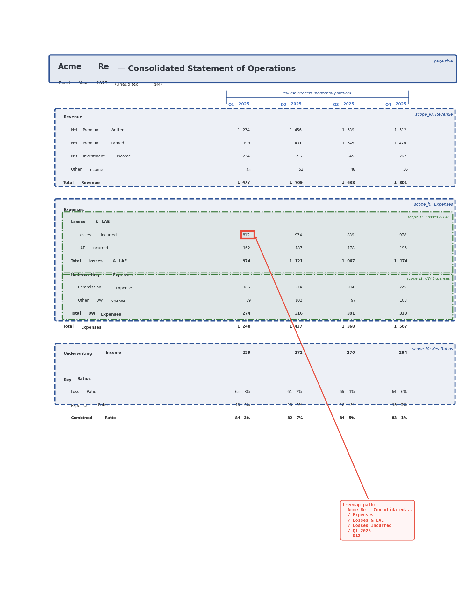

# Progressive Masking and Treemap Layout Recovery

> Every document page is a treemap. Labels partition vertical space into
> nested scopes; column headers partition horizontal space. The address of
> any cell is the path from root to leaf through these partitions.

## The Problem

Given a PDF or XLSX document rendered as a flat set of bounding boxes
`(page, x, y, w, h, text, style)`, recover:

1. Which bboxes are **structural** (labels, headers, titles) vs **content** (measures, dimensions)
2. The **hierarchical scope** each content cell belongs to
3. A **treemap path** that fully qualifies each value — equivalent to a compound key in a normalized table

## Masking vs Removal

A critical distinction: masking a bbox means classifying it and marking
it as "resolved," but it **still occupies space** in the geometric
layout. This is different from removing it.

If you *remove* a classified bbox, the gap it leaves can cause false
column alignments or merge two table regions that were separated by a
label row. For example, a bold section header "Expenses" at row 15
separates the Revenue table above from the Expenses data below. Remove
it, and rows 14 and 16 appear contiguous — downstream column detection
may merge them into one table. Mask it, and the row remains as a spatial
boundary. The mask **preserves the spatial topology** while excluding
the bbox from the classification working set.

This matters most for:
- **Label rows** that separate table regions
- **Title rows** that establish scope boundaries
- **Blank rows** that are structural whitespace

The mask is a tag, not a deletion. Spatial algorithms always see the
full page; classification algorithms see only the unresolved residual.

## Progressive Masking

Classification proceeds in rounds. Each round identifies a category of
bboxes and **masks them** (tags them as resolved). Later rounds operate
on a smaller, less ambiguous residual. Earlier rounds are cheaper and
higher-confidence; later rounds are more expensive and speculative.

### Round 0: Font/style histogram (metadata only, no text analysis)

Before looking at any text content, histogram bboxes by `(font_id,
font_size, weight, color)`. The dominant style — the highest bin count
— is almost certainly the body/data style. Styles with low bin counts
are structural: titles, headers, footnotes, captions.

This works because:
- Documents use a small number of styles consistently (typically 3-6)
- Data cells vastly outnumber structural cells in tabular documents
- Even a single page with 5 headers and 200 data cells gives a clear
  signal

Assign a **role prior** to each style based on bin rank:

| Bin rank | Likely role | Action |
|---|---|---|
| 1st (most common) | Body / data cell | Leave unmasked (default) |
| 2nd | Column header or row label | Flag as structural candidate |
| 3rd+ (rare) | Title, subtitle, footnote | Mask as structural |

**Important caveat**: the assumption "more data than non-data" doesn't
always hold. Cover pages, tables of contents, legal narrative, and forms
with many labels and few values all violate it. But this doesn't break
the approach if treated as a **prior rather than an assumption**: the
dominant style is the *default category*, not necessarily "data." On a
cover page, the dominant style is body text — all structural, and
correctly identified as common. The histogram tells you what's common
(needing less classification effort) vs rare (needing more scrutiny).
That's the right allocation of attention regardless of page type.

### Round 1: Pattern-based classification (regex, TRY_CAST, stop words)

Fast, high-confidence classification using text content:

- **TRY_CAST probes**: pure integers, floats, dates → mask as `measure`
  or `date`
- **Regex probes**: currency (`$12,400`), percentages (`65.8%`), zip
  codes, UUIDs, ISO dates, phone numbers, email → mask as typed values
- **Stop words / common vocabulary**: tokens matching a ~50K common
  English words bitmap AND NOT matching any domain filter → mask as
  `structural` (prose, labels, boilerplate)

Stop word masking is particularly important here because it blocks
spatial analysis from finding false column alignments through common
words that happen to be vertically aligned.

### Round 2: Page chrome

- **Page title**: largest font size on the page, positioned in the top
  region (corroborated by round 0 rare-style detection)
- **Page number**: short numeric text at the bottom of the page
- **Repeating headers/footers**: identical text at the same `(x, y)`
  across multiple pages

Page title and page number form the **outermost scope layer** — they
apply to every bbox on their page.

### Round 3: Domain filter probing (set-oriented)

This is where the [[blobfilters]] roaring bitmap infrastructure and the
set-oriented probing advantage (see [[Hash Collision Analysis for Domain
Filters]]) come together:

- Group unmasked bboxes into columns using spatial alignment
- Build a query bitmap from each column's values
- Compute containment against domain filters
- Columns with high containment (> 0.8) are classified as dimension
  columns; their values are masked as `dimension:<domain_name>`

The table detection from earlier rounds isn't just about structure — it
assembles the column-shaped sets that make domain probing exponentially
more reliable (false positive rate drops as ~p^N rather than p).

### Round 4: Embedding / LLM fallback

- Only genuinely ambiguous bboxes reach this expensive layer
- The progressive masking typically eliminates 70-90% of bboxes before
  this point
- Set-oriented probing means even this layer can benefit: cluster
  remaining bboxes by spatial proximity and classify the cluster, not
  individual tokens

## Label Scope Propagation

A bold label or section header is **in force to the right and downward**
until the next label at the same or lesser indent level.

### Indent levels from geometry

Labels are identified by style (bold weight, larger font) and position
(leftmost cell in a row with no numeric content). Their x-coordinate
determines their indent level — clustered by gap-based analysis of
distinct left-edge positions:

```
x ≈ 60   → indent level 0  (e.g., "Revenue", "Expenses")
x ≈ 78   → indent level 1  (e.g., "Net Premium Written", "Losses & LAE")
x ≈ 96   → indent level 2  (e.g., "Losses Incurred", "Commission Expense")
```

### Scope rules

1. A label at level N is in force for all rows below it until the next
   label at level ≤ N
2. A label at level N **resets** all deeper scopes (level > N)
3. Column headers partition horizontally within each scope band

### Example: insurance financial statement

```
Acme Re — Consolidated Statement of Operations     ← page title (outermost scope)
Fiscal Year 2025 (Unaudited, $M)                   ← subtitle scope

                        Q1 2025   Q2 2025   Q3 2025   Q4 2025    ← column headers

Revenue                                                           ← scope_l0
  Net Premium Written    1,234     1,456     1,389     1,512      ← row label + measures
  Net Premium Earned     1,198     1,401     1,345     1,478
  Net Investment Income    234       256       245       267
  Other Income              45        52        48        56
Total Revenue            1,477     1,709     1,638     1,801      ← total (bold)

Expenses                                                          ← scope_l0
  Losses & LAE                                                    ← scope_l1
    Losses Incurred        812       934       889       978      ← leaf values
    LAE Incurred           162       187       178       196
  Total Losses & LAE      974     1,121     1,067     1,174
  Underwriting Expenses                                           ← scope_l1
    Commission Expense     185       214       204       225
    Other UW Expense        89       102        97       108
  Total UW Expenses       274       316       301       333
```

The measure cell `812` at row "Losses Incurred", column "Q1 2025" has
the treemap path:

```
Acme Re — Consolidated Statement of Operations
  / Fiscal Year 2025
  / Expenses
  / Losses & LAE
  / Losses Incurred
  / Q1 2025
  = 812
```

This path is exactly the compound dimension key you'd need if this data
were in a star schema fact table.

## The Page as Treemap


Below, the same structure rendered from actual extracted bboxes with scope
partition lines overlaid. Blue dashed = level-0 sections, green dash-dot =
level-1 subsections, red highlight = treemap path to a single leaf cell:



The page **is** a treemap — the labels define the partition boundaries:

1. **Level-0 labels** ("Revenue", "Expenses") divide the page into
   vertical bands spanning the full width
2. **Level-1 labels** ("Losses & LAE", "Underwriting Expenses") subdivide
   those bands, indented — narrower horizontal extent
3. **Column headers** ("Q1 2025", ...) partition horizontally within each band
4. **Leaf cells** (the numbers) sit at the intersection of a vertical
   scope path and a horizontal column

The masking pattern itself encodes structure: a column where every cell
blanked out (all common-vocab matches) is a label column. A row where
most cells blanked out is a header row. The blank regions **are** the
tree nodes; the remaining visible cells are the leaf values.

This works for documents that aren't tables at all. A legal contract with
sections, subsections, and clauses has the same spatial structure —
indented headings partition vertical space. The "measures" are clause text
rather than numbers, but the treemap address is the same.

## Implementation

The current prototype is in `experiments/progressive_masking.py` — a
single DuckDB SQL pipeline with ~15 CTEs:

1. **RAW**: extract bboxes with styles, deriving bold from font name
2. **ROWS**: gap-based row clustering (handles punctuation baseline offsets)
3. **CELLS / MERGED / CLEAN**: cell merging within rows
4. **PAGE_SCOPE**: page title and page number detection
5. **ROUND1**: TRY_CAST + regex classification (measures, dates, currency)
6. **INDENT_BINS**: gap-based indent level detection from left edges
7. **LABELS**: identify labels by bold weight + position + numeric content
8. **SCOPE_PROPAGATED / SCOPED**: window-function-based scope propagation
   with level reset
9. **COL_HEADERS**: column header detection
10. **FINAL**: assembly with treemap path via `CONCAT_WS`

### Current results

| Document | Resolved | Rate |
|---|---|---|
| Financial statement (PDF) | 51/91 | 56% |
| Sales table (XLSX) | 32/54 | 59% |
| Multi-table (PDF) | 14/35 | 40% |
| Sales table (PDF) | 9/54 | 17% |

The XLSX case performs best because cells are atomic (no fragment merging
needed). PDF resolution is lower due to:

- Numbers with thousand separators ("1,234") becoming "1, 234" after
  fragment merging, which breaks numeric detection
- Column headers being bold (white-on-blue) and thus misclassified as
  section labels

These are pipeline logic issues, not architectural problems.

## Relationship to Other Components

- **[[blobfilters]]**: roaring bitmap domain membership probes — used in
  rounds 3-4 for common vocab and domain classification
- **[[blobboxes]]**: the bbox extraction layer that feeds this pipeline
- **[[blobembed]]**: embedding-based classification — only needed for
  bboxes that survive all masking rounds
- **[[blobhttp]]**: browser extraction via proxy — produces the same bbox
  format from rendered web pages

## What's Next

1. Fix the two PDF issues (comma-space numbers, column header detection)
2. Build the common-vocabulary bitmap (~50K English words as a blobfilter)
3. Connect domain filter probing from blobfilters
4. Treemap visualization — render the scope partitions as nested rectangles
5. Evaluate on real-world financial statements and insurance documents
